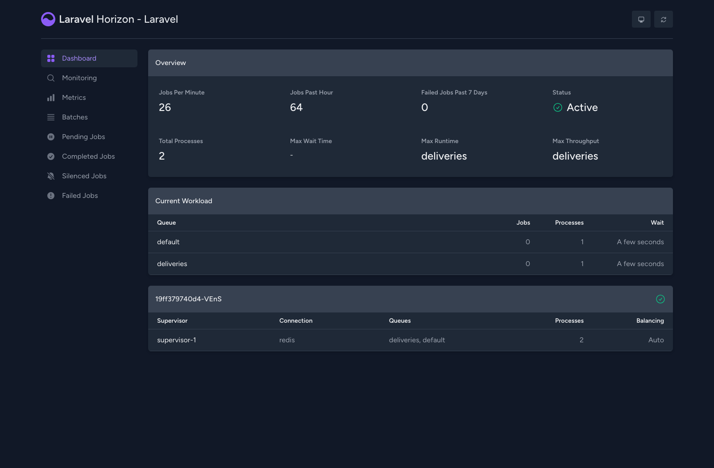

# Магазин цифровых товаров — Бэкенд

Бэкенд ядро магазина цифровых товаров. Laravel 13 + PostgreSQL + Redis.

## Архитектура

```
app/
├── Actions/                    # (зарезервировано для будущих action-классов)
├── Console/Commands/           # ReconcileOrdersCommand
├── DTO/                        # IssueRequest, IssueResult
├── Enums/                      # OrderStatus, PaymentEventStatus, ProductKeyStatus, DeliveryStatus
├── Http/
│   ├── Controllers/            # OrderController, PaymentWebhookController, ReconciliationController
│   └── Requests/               # CreateOrderRequest, PaymentWebhookRequest
├── Jobs/                       # DeliverProductJob, RecoverStaleOrdersJob
├── Models/                     # Product, Order, PaymentEvent, ProductKey, Delivery, SupplierRequest, MoneyMovement
├── Providers/                  # SupplierServiceProvider
├── Services/                   # OrderService, PaymentService, DeliveryService, ReconciliationService
└── Suppliers/                  # SupplierA, SupplierB, SupplierManager, Contracts/SupplierInterface
```

**Стек**: PHP 8.3+, Laravel 13, PostgreSQL 16+, Redis, Laravel Horizon, Laravel Reverb,
Vue 3 + Inertia, PHPUnit.

## Стратегия exactly-once доставки

Система гарантирует ровно одну доставку через **6 уровней защиты**:

### 1. `payment_events.event_id` UNIQUE
Дублирующие вебхуки отклоняются на уровне базы данных. Никаких гонок «сначала проверь потом вставь» на уровне приложения.

### 2. Построчная блокировка `orders`
`PaymentService::processPayment()` использует `DB::transaction()` + `lockForUpdate()` на строку заказа для сериализации конкурентных платежей по одному заказу.

### 3. `deliveries.order_id` UNIQUE
Один заказ может иметь максимум одну запись о доставке. `DeliveryService::getOrCreateDelivery()` использует `firstOrCreate`, подкреплённый ограничением уникальности.

### 4. Атомарный «захват» заказа перед выдачей
`DeliveryService::claim()` делает условный `UPDATE orders SET status='delivering' WHERE id=? AND status IN ('paid','out_of_stock','delivery_failed')`.
Захват удаётся ровно одному воркеру, поэтому повторы задачи, дубли из очереди и
фоновая сверка не могут запустить выдачу параллельно. Условный `UPDATE` выбран
вместо блокировки строки, чтобы не держать транзакцию открытой во время
медленных обращений к поставщику.

### 5. `product_keys.order_id` UNIQUE + `SKIP LOCKED`
`SELECT ... FOR UPDATE SKIP LOCKED` позволяет разным воркерам брать разные ключи,
не блокируя друг друга. Само по себе это **не** даёт exactly-once: без захвата (п. 4)
восемь параллельных воркеров по одному заказу разобрали бы восемь разных ключей.
Поэтому `UNIQUE(order_id)` закрепляет инвариант на уровне БД: заказ расходует
максимум один ключ, ключ уходит максимум в один заказ.

### 6. `supplier_requests.request_id` UNIQUE
Мок-поставщики хранят результаты по ключу `request_id`. Повтор с тем же `request_id`
возвращает **ранее выданный код**, предотвращая двойную выдачу.
Кэшируется только успех: ошибка должна допускать повторную попытку, иначе заказ
навсегда застрял бы в `delivery_failed` (`request_id` детерминирован по заказу).

## Семантика таймаута

**Таймаут ≠ Отказ.** Когда запрос к поставщику завершается по таймауту, исход неизвестен — поставщик мог уже выдать ключ.

- Повторы используют **тот же `request_id`** — никогда не генерируйте новый.
- Мок-поставщики сначала проверяют `request_id` и возвращают ранее сохранённые результаты.
- Только однозначные ошибки (HTTP 5xx, отказ соединения) приводят к переходу к следующему поставщику.

## Фоллбэк поставщиков

```
Supplier A
  ├── успех → доставлено
  ├── таймаут → повтор A (тот же request_id)
  ├── попытки исчерпаны → Supplier B
  └── B успех → доставлено
```

Фоллбэк безопасен, потому что:
- Один и тот же `request_id` предотвращает двойную выдачу
- Запись доставки имеет `UNIQUE(order_id)` — невозможно создать две
- Даже если оба поставщика успешно выдали ключ, сохраняется только один

## Восстановление

**ReconcileStaleOrdersJob** запускается каждые 5 минут через планировщик. Также доступен через:

```bash
php artisan orders:reconcile
```

Находит и восстанавливает:
- `paid` без доставки → диспатч доставки
- `delivering` зависший (>5 мин) → повторный диспатч
- `out_of_stock` → повторная проверка наличия
- `delivery_failed` → повторная попытка

## Журнал денежных движений

`money_movements` — **двойная запись**, только на добавление. Каждое событие пишет
группу строк (`entry_group`), знаковые суммы внутри которой в сумме дают ноль.
Ничего не обновляется и не удаляется: исправление — это новая проводка.

| Счёт | Смысл |
|------|-------|
| `cash` | фактически полученные от платёжной системы деньги |
| `deferred_revenue` | оплачено, но не выдано — наше обязательство перед клиентом |
| `revenue` | признаётся в момент фактической передачи кода |

```
оплата принята:     cash +1290,             deferred_revenue -1290
код выдан:          deferred_revenue +1290, revenue          -1290
```

**Почему всегда сходится.** `LedgerService::post()` отказывается записать группу,
которая не даёт в сумме ноль — несбалансированная проводка не может попасть в БД
даже при ошибке в вызывающем коде. Отсюда инвариант: `SUM(amount) = 0` по всему
журналу в любой момент.

Признаётся ровно та сумма, которая была получена по заказу, а не прайсовая цена.
Иначе заказ, оплаченный на другую сумму, навсегда оставил бы остаток на
`deferred_revenue`. Расхождение цены и платежа — отдельная аномалия
(`amount_mismatch` в сверке), а не повод разбалансировать книги.

**Второй инвариант:** модуль баланса `deferred_revenue` обязан равняться сумме цен
заказов, которые оплачены, но ещё не выданы (`paid`, `delivering`, `out_of_stock`,
`delivery_failed`). Если эти числа разошлись — деньги и товародвижение
рассинхронизированы. Обе проверки выводит сверка:

```bash
php artisan orders:reconcile
```

```
Money ledger:
  revenue             -2,580.00
  deferred_revenue         0.00
  cash                 2,580.00
  TOTAL                    0.00
  owed to customers        0.00
  undelivered value        0.00
  ledger reconciles
```

Команда возвращает ненулевой код выхода, если журнал не сошёлся — годится для
мониторинга. Те же инварианты проверяются под гонкой в `race:test` и тестами
`tests/Feature/MoneyLedgerTest.php`.

## Запуск

### Docker (рекомендуется)

```bash
docker compose up -d --build            # app + postgres + redis + horizon
docker compose exec app php artisan db:seed
```

Horizon поднимается отдельным контейнером `dgs_horizon`, запускать его через
`exec` не нужно. Миграции выполняются на старте контейнера `app`.

Чтобы дополнительно открыть стенд наружу через Cloudflare Tunnel:

```bash
docker compose --profile tunnel up -d
docker logs dgs_tunnel | grep trycloudflare.com
```

Или одной командой — `./scripts/start.sh --tunnel` дождётся готовности приложения
и напечатает публичный адрес.

Это **quick tunnel**: аккаунт Cloudflare, свой домен и `cloudflared tunnel login`
не нужны. Взамен три ограничения:

- Адрес выдаётся случайный и меняется при каждом пересоздании контейнера
  `dgs_tunnel`. Сохранить конкретный `*.trycloudflare.com` нельзя.
- Ссылка публичная — сайт видит любой, у кого она есть.
- Регистрация недолговечна. Через несколько часов Cloudflare может разорвать её,
  и в логе пойдёт `control stream encountered a failure`. Контейнер при этом не
  падает и сам новый адрес не запрашивает, поэтому лечится пересозданием:

  ```bash
  docker compose --profile tunnel up -d --force-recreate tunnel
  ```

Если нужен постоянный адрес — это named tunnel: он требует аккаунт Cloudflare с
добавленным доменом, `cloudflared tunnel login`, `cloudflared tunnel create` и
токен туннеля в переменной `CLOUDFLARE_TUNNEL_TOKEN`. Тогда сервису `tunnel` в
`docker-compose.yml` вместо `--url` задаётся `tunnel --no-autoupdate run`.

### Локально

Требуется PostgreSQL и Redis, запущенные локально.

```bash
# Обновите .env с учётом ваших учётных данных PostgreSQL
php artisan migrate --seed
php artisan serve
php artisan horizon
```

## Живая витрина, бронь и гонка за последней единицей

### Бронь держит ключ, а не товар

Заказ забирает **один конкретный `product_key`** и снимает его с витрины сразу,
ещё до оплаты. Держится это двумя частичными уникальными индексами:

```sql
UNIQUE (product_key_id) WHERE cancelled_at IS NULL   -- один ключ — одна бронь
UNIQUE (order_id)       WHERE cancelled_at IS NULL   -- один заказ — одна бронь
```

Выбор ключа идёт под `FOR UPDATE SKIP LOCKED`, поэтому параллельные покупатели
разбирают **разные** ключи, а не выстраиваются в очередь за одним.

Через пять минут `schedule:work` (контейнер `dgs_scheduler`) снимает просроченные
брони: ключ возвращается в `available`, счётчик витрины растёт обратно, и об этом
уходит broadcast. Неудачная оплата освобождает ключ сразу, не дожидаясь таймера.

### Отказ вместо ошибки

Если свободного ключа не осталось, заказ **не создаётся**: `POST /api/orders`
отвечает `409` с телом `{"error":"sold_out","message":"…","sku":"…"}`. Проигравший
в гонке не получает заказ, который нечем закрыть, и не может его оплатить.

Заказ при нулевом остатке всё ещё возможен — но только явно, через
`OrderService::createOrder($product, null, requireStock: false)`. На этом держится
критерий 6: платёж записывается, заказ паркуется в `out_of_stock`, а сверка
доводит его до выдачи после пополнения или через внешнего поставщика.

### Реальное время

`CatalogUpdated` и `OrderStatusChanged` уходят в Laravel Reverb (`dgs_reverb`).
Наружу и сайт, и WebSocket смотрят через один origin: nginx (`dgs_proxy`) отдаёт
`/app` в Reverb, всё остальное — в приложение. Поэтому живые обновления работают
и на `localhost`, и через Cloudflare Tunnel, который умеет пробрасывать только
один адрес.

Фронтенд берёт хост и порт сокета из `window.location`, ничего не зашивая. Бейдж
«Live» привязан к состоянию соединения pusher-js — он не может утверждать, что
связь есть, когда её нет.

### Как воспроизвести

**Живое обновление.** Откройте витрину в двух вкладках и заберите единицу мимо
браузера:

```bash
curl -X POST localhost:8080/api/orders -H 'Content-Type: application/json' \
     -d '{"sku":"KEY-CS2-PRIME"}'
```

Остаток на карточках уменьшится в обеих вкладках без перезагрузки. Когда он дойдёт
до нуля, кнопка «Купить» станет неактивной одновременно у всех.

**Гонка за последней единицей.** Оставьте у товара один ключ и ударьте двумя
запросами сразу:

```bash
for i in 1 2; do
  curl -s -o /dev/null -w "%{http_code}\n" -X POST localhost:8080/api/orders \
       -H 'Content-Type: application/json' -d '{"sku":"GIFT-ROBLOX-800"}' &
done; wait
```

Один ответ `201`, другой `409` с сообщением «Этот товар только что раскупили».

**Бронь с таймером.** Откройте `/orders/{id}` сразу после создания заказа — там
идёт обратный отсчёт. Через пять минут (или после `UPDATE reservations SET
expires_at = now() - interval '1 minute'`) планировщик вернёт ключ в продажу.

## Очереди и Horizon

Ключ выдаётся не в HTTP-запросе. Вебхук оплаты только переводит заказ в `paid` и
ставит `DeliverProductJob` в очередь `deliveries`; саму выдачу выполняет фоновый
воркер. Очередь разбирает **Laravel Horizon** — он работает отдельным контейнером
`dgs_horizon`.

Панель доступна локально на <http://localhost:8080/horizon>:



Супервизор слушает `deliveries` и `default` именно в таком порядке (`config/horizon.php`),
чтобы выдача ключей не ждала за остальными задачами. Если очередь `deliveries` не
указана в конфиге, заказы навсегда зависают в статусе `paid` — задачи копятся в
Redis, но их некому взять.

Через публичный туннель панель отвечает `401`. Это не Horizon, а `laravel/sentinel`,
который Horizon вешает на свои маршруты: он отклоняет доступ, когда запрос пришёл
через доверенный прокси с публичного IP. Ограничение намеренное — в Horizon можно
перезапускать и удалять задачи, поэтому наружу панель не отдаётся.

## API

```
GET    /api/catalog                  — Витрина остатков (keyset-пагинация)
GET    /api/search                   — Полнотекстовый поиск (q, type, in_stock)
POST   /api/orders                   — Создать заказ (тело: {sku}); 409, если раскуплен
GET    /api/orders/{id}              — Получить заказ + доставку
POST   /api/webhooks/payment         — Вебхук оплаты
POST   /api/internal/reconciliation  — Запустить сверку и восстановление
```

Команды:

```
php artisan orders:reconcile       — сверка, восстановление, проверка журнала
php artisan catalog:recount        — проверить/починить счётчик остатков
php artisan catalog:benchmark      — планы выполнения витрины
php artisan race:test              — проверка exactly-once под гонкой
```

Полная документация API: [API.md](./API.md)

## Тестирование

```bash
php artisan test
```

### Критерии приёмки

`tests/Feature/AcceptanceCriteriaTest.php` содержит по одному тесту на каждый
критерий из задания и прогоняет реальный стек контроллеров и сервисов
(очередь `sync`, поэтому выдача выполняется внутри запроса):

```bash
php artisan test --filter=AcceptanceCriteriaTest
```

| # | Критерий | Тест |
|---|----------|------|
| 1 | 50 параллельных вебхуков, ровно одна выдача | `test_criterion_1_fifty_repeated_webhooks_issue_exactly_once` |
| 1b | 50 разных событий по одному заказу, без потерь и дублей | `test_criterion_1_fifty_distinct_events_still_issue_exactly_once` |
| 2 | Повтор `event_id` ничего не меняет | `test_criterion_2_repeated_event_id_is_a_no_op` |
| 3 | Вебхук раньше заказа | `test_criterion_3_webhook_before_order_is_accepted_and_applied_later` |
| 3b | Вебхуки вне порядка | `test_criterion_3_out_of_order_events_do_not_resurrect_a_final_order` |
| 4 | Таймаут после фактической выдачи | `test_criterion_4_timeout_retry_does_not_double_issue` |
| 5 | Поставщик A недоступен, фоллбэк на B | `test_criterion_5_fallback_to_supplier_b_issues_once` |
| 6 | Пустой остаток, восстановление без падения | `test_criterion_6_empty_stock_is_recoverable_without_crashing` |
| — | Дубли воркеров выдачи расходуют один ключ | `test_repeated_delivery_attempts_consume_only_one_key` |

### Проверка гонок в реальном времени

PHPUnit проверяет инварианты внутри процесса, но не даёт настоящей
параллельности. Команда `race:test` бьёт по работающему серверу N по-настоящему
одновременными вебхуками (`curl_multi`) и затем проверяет инварианты в БД.
Нужен PostgreSQL — на sqlite нет построчных блокировок.

```bash
docker compose up -d postgres
php artisan migrate:fresh --seed
```

Сервер обязательно запускать многопроцессно, иначе встроенный сервер PHP
обработает запросы последовательно и гонки не будет:

```bash
PHP_CLI_SERVER_WORKERS=12 php artisan serve --port=8123
```

```bash
php artisan race:test --sku=KEY-CS2-PRIME --count=50
```

Команда прогоняет два режима — 50 одновременных вебхуков с **одним** `event_id`
(повторная доставка) и с **разными** `event_id` (конкурентные события) — и
проверяет: заказ в `delivered`, ни одно событие не потеряно, ровно одно денежное
движение, одна доставка, один израсходованный источник выдачи (локальный ключ
**или** код поставщика).

### Отказ и фоллбэк поставщика

Доли отказов/таймаутов задаются переменными окружения, поэтому сценарии
воспроизводимы. `STEAM-TOPUP-*` не имеет локальных ключей, поэтому идёт через
поставщиков:

```bash
SUPPLIER_A_TIMEOUT_RATE=1 PHP_CLI_SERVER_WORKERS=12 php artisan serve --port=8123
```
Ловушка таймаута: A выдаёт код, ответ теряется, повтор с тем же `request_id`
возвращает тот же код. Ожидается одна запись в `supplier_requests`, `attempts=2`.

```bash
SUPPLIER_A_FAILURE_RATE=1 PHP_CLI_SERVER_WORKERS=12 php artisan serve --port=8123
```
Фоллбэк: A недоступен, выдача уходит на B ровно один раз.

```bash
SUPPLIER_A_OUT_OF_STOCK_RATE=1 SUPPLIER_B_OUT_OF_STOCK_RATE=1 PHP_CLI_SERVER_WORKERS=12 php artisan serve --port=8123
```
Пустой остаток: заказ переходит в `out_of_stock` (восстановимое состояние, без
падения, вебхук по-прежнему `200`). После пополнения остатка:

```bash
php artisan orders:reconcile
```
заказ доводится до `delivered` без задвоения.

### Статический анализ

```bash
./vendor/bin/phpstan analyse
```

## Каталог под нагрузкой

Горячий запрос — витрина остатков: «покажи товары такого-то типа, которые есть в
наличии». Наивно это join + `GROUP BY` по `product_keys`, то есть агрегация всей
таблицы ключей до того, как `LIMIT` успеет что-то отбросить. На тысячах SKU и
сотнях тысяч ключей это самый дорогой запрос в системе.

**Решение — денормализованный счётчик.** `products.available_keys_count` хранит
`COUNT(product_keys WHERE status='available')`. Витрина читает только `products`:
ни join, ни `GROUP BY`.

Счётчик — это кэш, поэтому у него есть и быстрый путь, и верификатор:

- уменьшается атомарным `UPDATE ... SET c = c - 1` **в той же транзакции**, что и
  резервирование ключа, — гонка не может потерять декремент;
- `catalog:recount` сверяет счётчик с таблицей ключей и чинит расхождения;
- `orders:reconcile` проверяет дрейф на каждом прогоне и чинит его автоматически.

```bash
php artisan catalog:recount --dry-run
```

### Индексы

Витрина смотрит только на строки «в наличии», поэтому индексы **частичные** —
они меньше таблицы и не содержат распроданных SKU. Пагинация keyset (`id > курсор`),
поэтому `id` идёт последней колонкой, а `INCLUDE` делает проекцию покрывающей:

```sql
CREATE INDEX products_storefront_idx ON products (type, id)
    INCLUDE (sku, name, price, currency, available_keys_count)
    WHERE available_keys_count > 0;

CREATE INDEX products_instock_idx ON products (id)
    INCLUDE (sku, name, type, price, currency, available_keys_count)
    WHERE available_keys_count > 0;
```

| Таблица | Индекс | Назначение |
|---------|--------|------------|
| `products` | `sku` UNIQUE | Поиск товара по SKU |
| `products` | `(type, id) WHERE available_keys_count > 0` | Витрина с фильтром по типу |
| `products` | `(id) WHERE available_keys_count > 0` | Витрина без фильтра |
| `orders` | `status` | Фильтрация по состоянию заказа |
| `payment_events` | `event_id` UNIQUE | Идемпотентность вебхука |
| `payment_events` | `(claimed_order_id, processed_at)` | Поиск непривязанных событий |
| `product_keys` | `product_id + status` | Поиск доступного ключа |
| `product_keys` | `order_id` UNIQUE | Один ключ на заказ |
| `deliveries` | `order_id` UNIQUE | Одна доставка на заказ |
| `supplier_requests` | `request_id` UNIQUE | Идемпотентность поставщика |
| `money_movements` | `entry_group`, `account` | Сверка журнала |

### План выполнения

Замер воспроизводится командой (генерирует 50 000 SKU и ~215 000 ключей):

```bash
php artisan catalog:benchmark --seed --products=50000 --keys-per-product=30
```

Фактические планы PostgreSQL 16 для `type='key' AND в наличии ORDER BY id LIMIT 24`:

**Наивно — join + GROUP BY**
```
GroupAggregate
  -> Merge Left Join
     -> Index Scan using products_pkey on products p
     -> Index Scan using product_keys_product_id_status_index on product_keys k
        (rows=214260)
Buffers: shared hit=50      Execution Time: 1.033 ms
```
Планировщик вынужден зайти в `product_keys` и агрегировать до `LIMIT`. Стоимость
растёт вместе с пулом ключей, а не с размером страницы.

**Со счётчиком**
```
Limit
  -> Index Only Scan using products_instock_idx on products
Buffers: shared hit=7       Execution Time: 0.035 ms
```
`Index Only Scan` — данные берутся прямо из индекса благодаря `INCLUDE`, к таблице
обращений почти нет. `product_keys` не участвует вовсе: 7 буферов против 50.

**Глубокая страница: OFFSET против keyset**
```
OFFSET 892:  Rows Removed by Filter: 2748   Buffers: shared hit=408
id > курсор: Index Cond: (id > 25004)       Buffers: shared hit=17
```
`OFFSET` обязан прочитать и выбросить всё, что до него, — стоимость линейно растёт
с глубиной страницы. Keyset превращает это в range scan по индексу: 24 строки
независимо от того, какая это страница — первая или тысячная. Поэтому витрина
отдаёт `meta.next_cursor`, а не номер страницы.

## Масштабирование
- **Воркеры**: `php artisan horizon`; выдача идемпотентна, поэтому воркеров можно
  добавлять свободно — «захват» заказа (`claim`) не даст двум обработать один заказ.
- **Чтение**: витрина не пишет и легко уходит на read-реплики; кэш перед ней
  безопасен, потому что счётчик меняется только при резервировании ключа.
- **Рост объёмов**: `payment_events` и `money_movements` только на добавление —
  естественные кандидаты на партиционирование по времени.
- **Узкое место**: `product_keys` под `SKIP LOCKED`. Пул ключей на популярный SKU
  можно шардировать, чтобы воркеры реже конкурировали за одни и те же строки.

## Конфигурация

Поведение поставщиков настраивается через `.env`:

Доли задаются **дробью от 0 до 1** (`1` = всегда, `0.25` = в четверти случаев),
отдельно для каждого поставщика (`SUPPLIER_A_*` и `SUPPLIER_B_*`):

```
SUPPLIER_A_FAILURE_RATE=0        # доля однозначных отказов (5xx)
SUPPLIER_A_TIMEOUT_RATE=0        # доля «зависаний»: код выдан, ответ не дошёл
SUPPLIER_A_OUT_OF_STOCK_RATE=0   # доля ответов «нет в наличии»
SUPPLIER_A_DELAY_MS=0            # симулированная задержка ответа
SUPPLIER_MAX_RETRIES=3           # попыток на одного поставщика
SUPPLIER_HTTP_TIMEOUT=5
```

Установите ненулевые значения для воспроизведения сценариев отказа, таймаута,
фоллбэка и пустого остатка (см. «Отказ и фоллбэк поставщика»).
